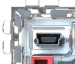
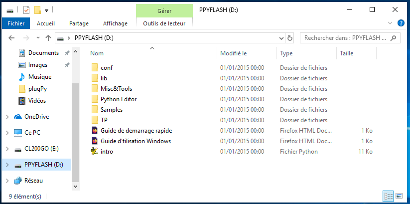
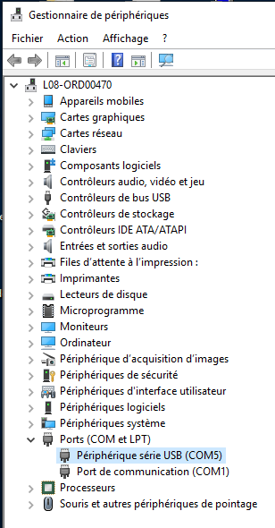

Connexion avec un ordinateur
=========================

## Liaison à l'ordinateur

On se place dans un **mode de fonctionnement non autonome** où le Plug' py est connecté à l'ordinateur via le bus USB, avec le câble fourni.  
On utilise le connecteur micro-usb dans le coin haut gauche du boitier et un des ports USB de l'ordinateur.  



## Détection

La détection ne pose aucun soucis avec les systèmes d'exploitation récents. Le boitier est vu comme un périphérique de stockage externe dont la taille proche de 128 Mo (*taille de la carte SD présente sur le système*), nommé `PPYFLASH`.  



Par ailleurs, on peut noter que le boitier est vu également comme un périphérique série, dont il est important de relever le numéro *COM* (pour les systèmes windows).  
Il suffit de faire un clic droit sur *Ce PC*, puis *propriétés* et *gestionnaire de périphérique*. En cas, d'échec du clic droit (absence de *Propriétés*), utiliser un raccourci vers le gestionnaire de périphérique, sur le bureau. 



Dans le cas de la capture, on note **COM5**. Attention, cette valeur n'est pas garantie sur les autres machines.


```python

```
