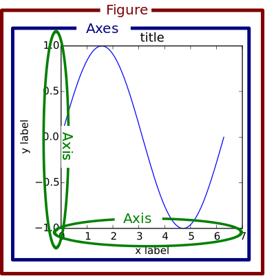
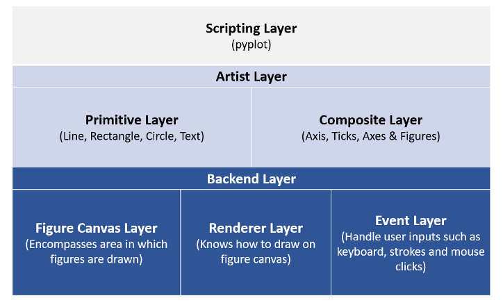
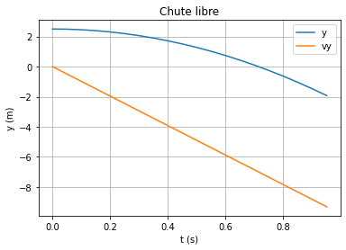
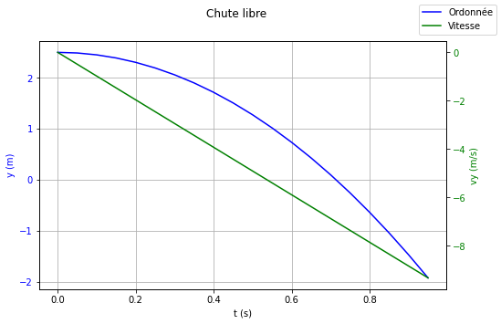

Tracer une courbe avec Matplotlib
=================================

## Brève introduction
[Matplotlib](https://matplotlib.org/) a été créé en 2003 par un neurobiologiste ([John Hunter](https://en.wikipedia.org/wiki/John_D._Hunter)) pour s'affranchir du logiciel MATLAB et notamment son caractère propriétaire.  
Une des caractéristiques de MATLAB est son style global totalement à l'opposé des processus d'*importation* de python. 

Un graphique `matplotlib` est constitué de nombreux *objets* hiérarchisés de la manière suivante:  



Les *objets* les plus importants à notre niveau sont: `Figure`, `Axes` et dans une moindre mesure `Axis`.  

`Matplotlib` est assez difficile d'approche pour les raisons suivantes:  

* la librairie est énorme (entre 70000 et 200000 lignes de code suivant les sources)
* il fournit plusieurs *interfaces* (façon de tracer une figure);
* certains points de la documentation ne sont pas à jour.

Enfin, d'un point de vue architecturale, `matplotlib` peut être décomposé en trois couches:



!!! tip "Remarque"
    La très grande majorité des scripts présents dans les manuels du secondaire, mais aussi dans la formation `Python en sciences physiques` dispensée sur Magistère, utilisent la *couche de script* avec `Pyplot`. Ce n'est pas forcément le meilleur choix ... (*voir ci-après*)

## Quelle interface choisir ?
### Interface Pylab
Afin de retrouver le style global de MATLAB, un module de `matplotlib` a été conçu: `Pylab`. L'utilisation de `Pylab` est contraire aux bonnes habitudes codage en python et peut être de surcroit à l'origine de nombreux bugs difficiles à cerner. D'après la documentation, disponible [ici](https://matplotlib.org/stable/api/index.html?highlight=pylab#module-pylab):   

> pylab is a module that includes matplotlib.pyplot, numpy, numpy.fft, numpy.linalg, numpy.random, and some additional 
> functions, all within a single namespace. Its original purpose was to mimic a MATLAB-like way of working by importing 
> all functions into the global namespace. This is considered bad style nowadays.

**On ne devrait donc PAS UTILISER CE MODULE**, contrairement au sujet [E3C Physique Chimie n° 02715](https://nsiboisdo.bdrd.fr/PC/doc/e3c-spe-physique-chimie-premiere-02715-sujet-officiel.pdf)!

### Interface avec état Pyplot (pour des cas très simples)

`Pyplot` fait partie de la couche *de script* de `matplotlib`. `Pyplot` possède une multitude de fonction permettant de tracer simplement des graphiques. Son utilisation libère l'utilisateur de toutes manipulations d'*objets* de plus bas niveau.  
En arrière plan, `Pyplot` créé, enregistre l'état de tous les objets utiles (`Figure`, `Axes`, etc.). Au final, on n'a qu'à saisir les commandes comme on le ferait dans un shell interactif.  

**Exemple**


```python
import matplotlib.pyplot as plt
import numpy as np


g = 9.81 # Intensité de la pesanteur
H = 2.5 # hauteur initiale

t = np.arange(0, 1, step=0.05, dtype=float)
vy = -g * t
y = -0.5 * g * t**2 + H

plt.title("y=f(t)")
plt.xlabel("t (s)")
plt.ylabel("y (m)")
plt.title("Chute libre")
plt.plot(t, y, label="y")
plt.plot(t, vy, label="vy")
plt.legend()
plt.grid()
plt.show()
```


    

    


Toutes les fonctions de `Pyplot`se réfèrent aux objets `Figure` ou `Axes` courants (ou alors les créent si ces derniers n'existent pas). Mais qu'en est-il si on a plusieurs graphiques (`Axes`) à gérer ?  
On voit sur l'exemple ci-dessus les premiers problèmes apparaître: les deux tracés partagent les mêmes axes et ... la parabole est très écrasée !   
Par ailleurs, le fait que `Pyplot` gère tout en arrière plan, ne nous permet pas de personnaliser au maximum nos graphiques. De ce fait, **cette interface n'est pas la plus recommandée**.

### Interface sans état ou approche orientée objet

C'est l'approche recommandée par la documentation officielle et notamment lorsqu'on doit **gérer plusieurs graphiques** ou **modifier des attributs très particuliers** de certains objets (graduation des axes par exemple).


```python
fig, ax1 = plt.subplots(figsize=(8,5))

ax1.set_ylabel("y (m)", color="blue")
ax1.set_xlabel("t (s)")
ax1.plot(t, y, "blue")
ax1.tick_params(axis="y", labelcolor="blue")
ax1.grid()

ax2 = ax1.twinx() # créé un 2ème axe sur la droite partageant le même axe Ox

ax2.set_ylabel("vy (m/s)", color="green")
ax2.tick_params(axis="y", labelcolor="green")
ax2.plot(t, vy, "green")

fig.suptitle("Chute libre")
fig.legend(["Ordonnée", "Vitesse"])
```


    <matplotlib.legend.Legend at 0x7fc852da63a0>


    

    


## Conclusion

Dans [la documentation](https://matplotlib.org/stable/api/index.html) officielle, on peut relever les passages suivants:  

> pyplot is mainly intended for interactive plots and simple cases of programmatic plot generation.

et  

> At its core, Matplotlib is object-oriented. We recommend directly working with the objects, if you need more control and customization of your plots.

Après lecture de cette page, on peut conclure qu'il faudrait adopter l'approche orientée objet afin de pouvoir mieux personnaliser ses graphiques. Dans tous les cas, on **n'utilisera plus l'interface pylab**.
