Les modes fonctionnements du Plug'Py
====================================

[Lien vers les scripts de cette présentation](https://nsiboisdo.bdrd.fr/PC/doc/Perso.zip)

## Le mode interface

La carte dispose d'un premier mode de fonctionnement appelé *Interface* dans lequel l'essentiel des opérations se déroule côté ordinateur.  

On peut tester ce mode avec un des programmes livrés avec le boitier (exemple `Temperature simple-PlugUnio-Py.py`).  

**Avis personnel**  

Ce mode de fonctionnement bien que séduisant souffre de gros défauts:  

* obligation d'avoir python installé sur l'ordinateur hôte;
* obligation d'avoir la librairie `libPlugPy` dans le même dossier que le programme à exécuter;
* syntaxe du code python utilisé très lourde lorsqu'on exécute une instruction destinée au microcontrôleur;
* utilisation de structures avancées du langage Python (`Exception`, contexte `try / except`, etc.) inutiles à ce stade d'apprentissage. 

## Le mode REPL

C'est le mode privilégié durant cette initiation. Il s'agit:  

* d'utiliser la liaison série;
* de *dialoguer* directement (sans librairie) avec le microcontrôleur, en python;
* finalement d'écrire ses scripts sur son ordinateur avec son éditeur de code préféré (*par exemple* **Thonny**).

Pour entrer dans ce mode, procéder selon la description ci-dessous.  
Sur la carte Plug'Uino Py:  

* appuyer et maintenir le bouton **USR** puis appuyer brièvement sur le bouton **RST** (*en haut à gauche*);
* dans le menu de l'écran du Plug' Py, choisir **Safe Mode** avec le bouton **USR** (appui court) puis valider par un appui long sur **USR**.  

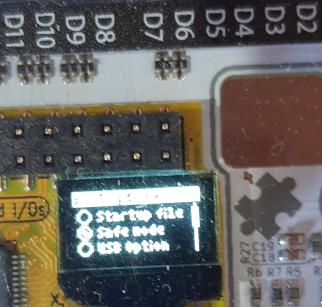

### Utiliser la liaison série

Plusieurs applications permettent d'atteindre cet objectif.  

#### PuTTY

Il s'agit d'une application légère, libre de droits, distribué sous licence [MIT](https://fr.wikipedia.org/wiki/Licence_MIT). Un raccourci `Putty Reseau` est disponible sur les ordinateurs de la salle A104.  

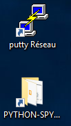

Il est nécessaire de procéder à quelques réglages, certains optionnels, d'autres obligatoires. On **DOIT**:  

* indiquer la *COM* utilisée;
* cocher *serial*.

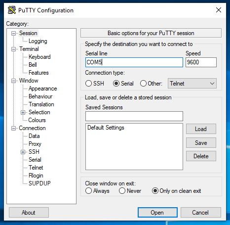

On **PEUT** adapter la police utilisée, notamment sa taille ;) car la police par défaut `Courier 10 pt` n'est guère lisible.   

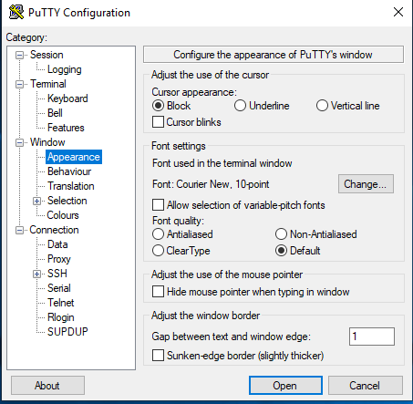

On valide en cliquant sur `Open`

#### EDI Thonny

Thonny est un environnement de développement intégré, très prisé par les débutants. C'est un logiciel libre, multiplateforme et qui peut être téléchargé à cette [adresse](https://thonny.org/).  
Après avoir démarré la carte en mode **Safe Mode**, il peut être utile, **la première fois**, de paramétrer Thonny pour l'utilisation avec le Plug'Uino Py. Il s'agira d'indiquer au système le *bon interpréteur python* à utiliser.  

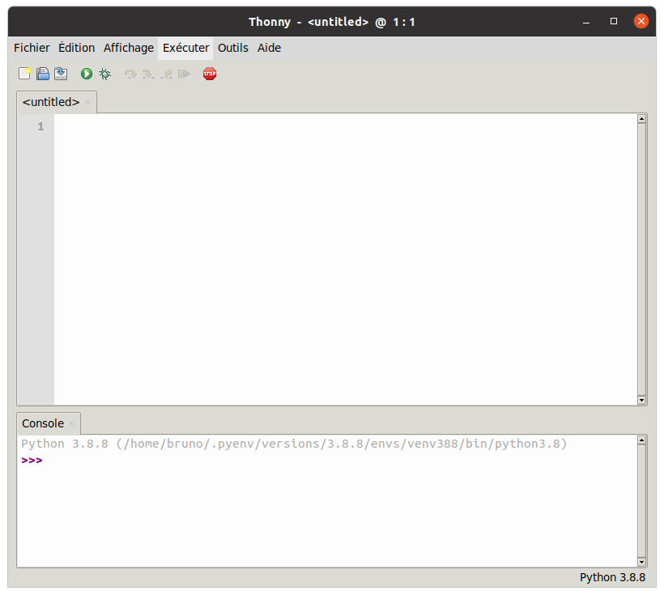

Sur la capture, on remarque que Thonny utilise l'interpréteur Python par défaut du système (Python 3.8), il faut changer cet état.  
1. Aller dans **Executer** puis choisir "Sélectionner l'interpréteur..."  

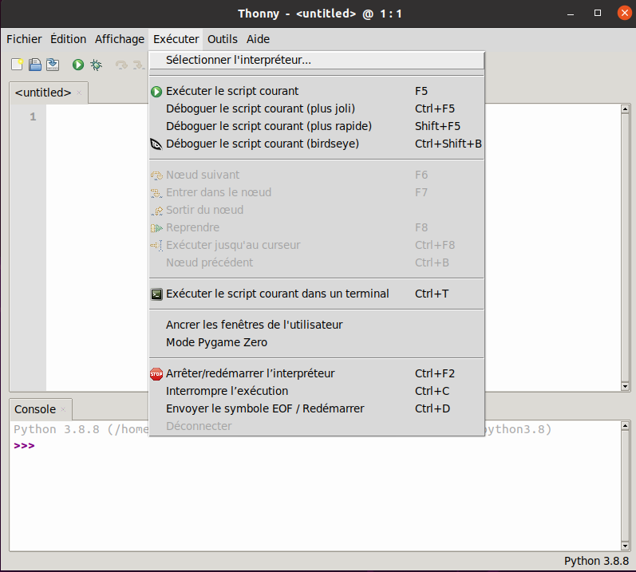  

2. Une nouvelle fenêtre s'ouvre; choisir l'onglet **Interpréteur**  
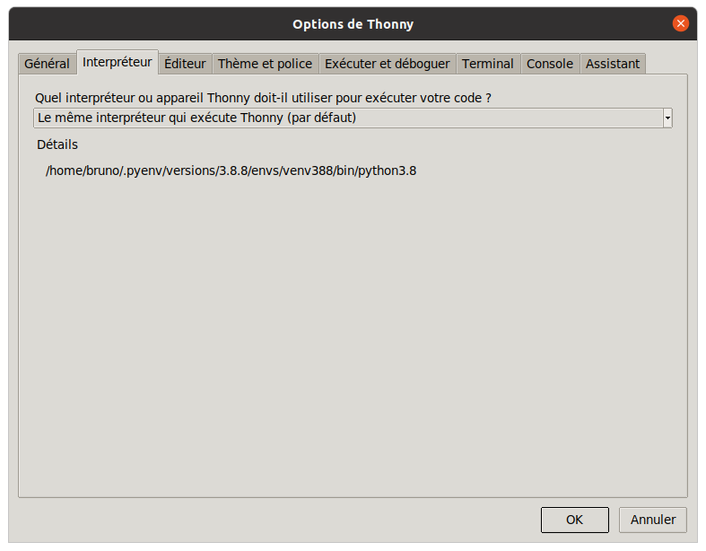  
3. Dans le menu déroulant, choisir **Micropython (générique)** puis dans le menu **Port** choisir la carte Plug'Uino Py (sur les systèmes Windows 10, c'est la ligne où apparait COM...)  
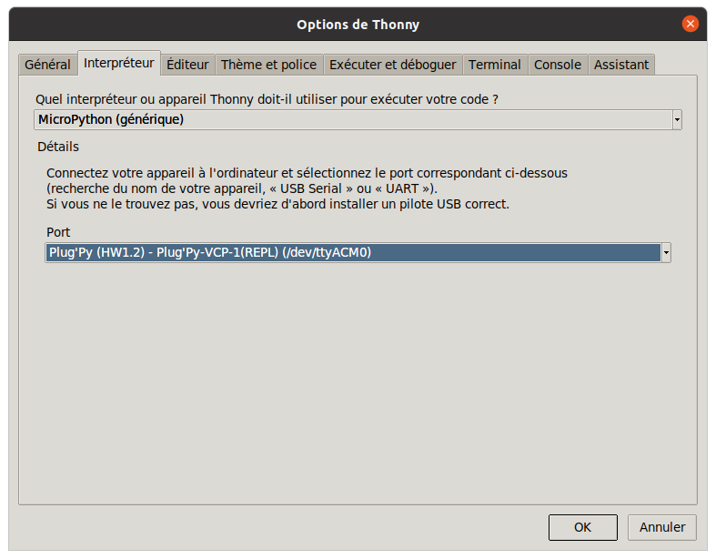  
4. Valider par **OK**, le système est configuré. On constate, via la console, que l'on travaille avec un interpréteur micropython (celui de la carte). On peut ne pas tenir compte de la présence d'éventuels *Warnings*.  
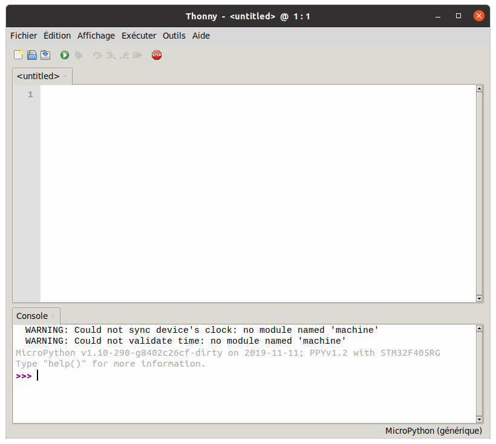

### Le dialogue avec le microcontrôleur - Interpréteur micropython

En cas de succès de l'ouverture d'une session, on se retrouve avec un interpréteur Python parfaitement fonctionnel.  

**Exemple avec Putty**  

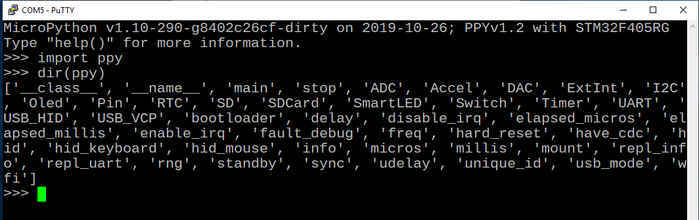  

**Exemple avec Thonny**

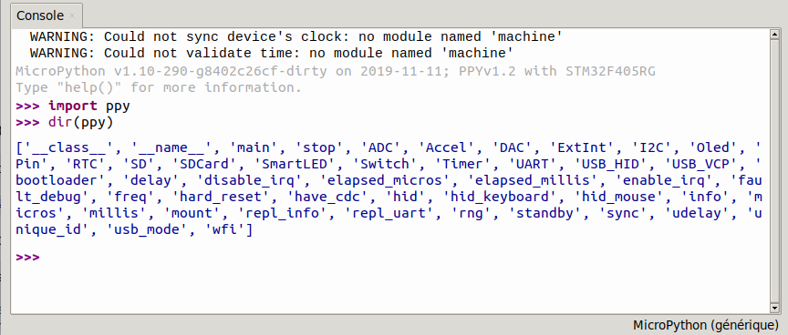

#### En cas d'échec de la connexion

Lorsque la connexion échoue, on pourra en première intention, effectuer certaines vérifications:
    
* le microcontrôleur est-il bien connecté à un port USB ? une led bleue sur le boitier permet de le confirmer;
* un programme en exécution sur le microcontrôleur n'est-il pas pas dans une boucle infinie ou en attente d'entrée ? une série de ++ctrl+c++ peut être la solution ...
* peut-on récupérer un interpréteur en effectuant un *RESET* avec la séquence de touches ++ctrl+d++ ou le bouton STOP de Thonny?

## Proposition de procédure de développement

Une fois la connexion établie avec le microcontrôleur, on peut commencer des tests dans l'interpréteur micropython.   

Si les tests sont concluants, on peut écrire un *script* dans la fenêtre d'édition de Thonny et l'enregistrer dans un dossier sur la carte. L'espace est très limité sur la carte (128 Mo), on y déposera **que** des scripts. De plus, on **évitera à tout prix de déposer ses fichiers n'importe où**! On pourra créer, par exemple, un dossier `Perso` dans le dossier `Samples` pour le stockage de ses fichiers personnels.  

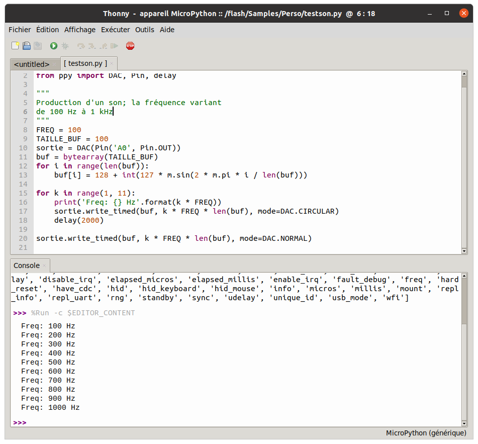
