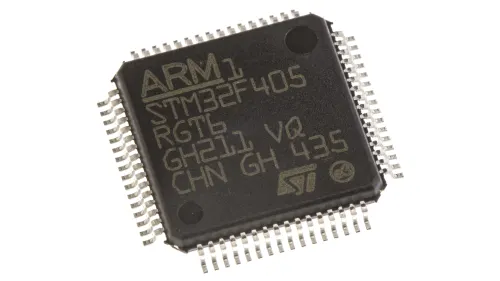
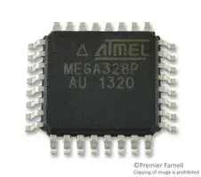
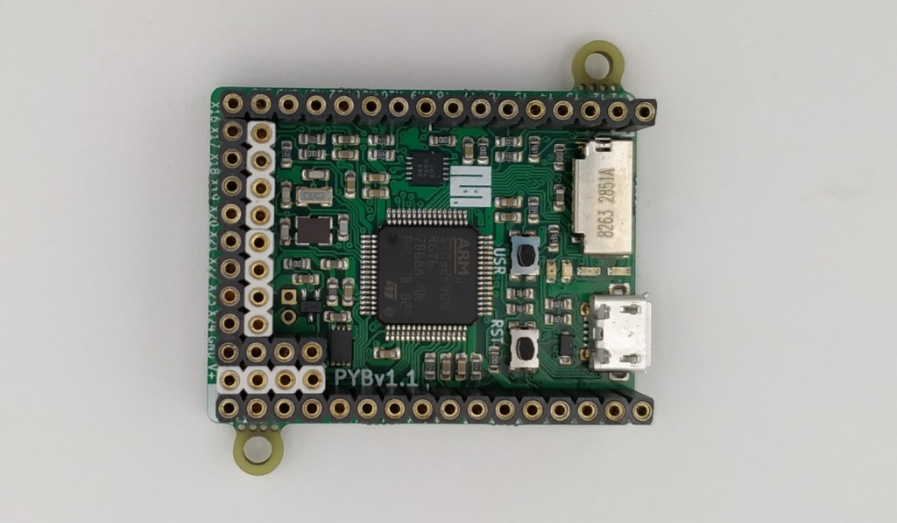
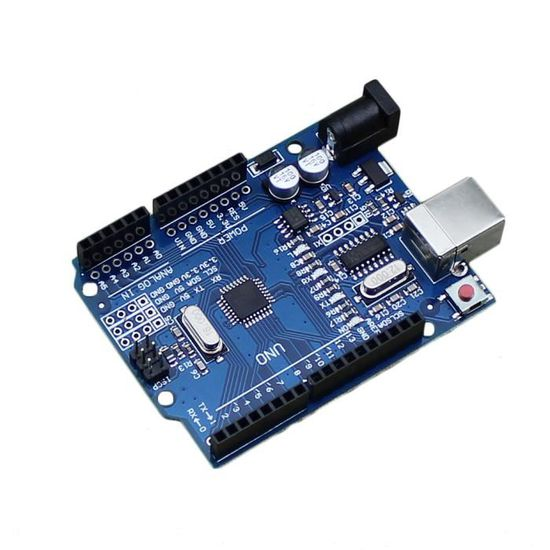
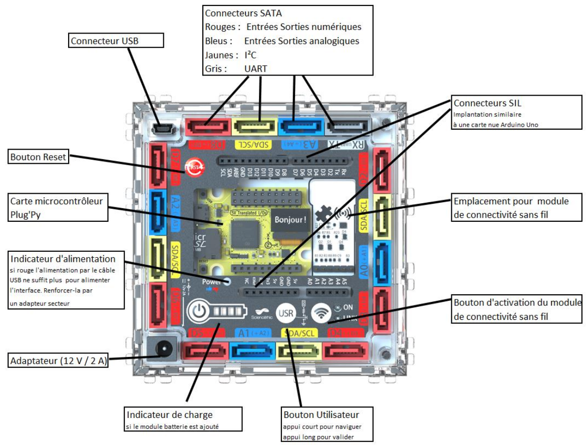
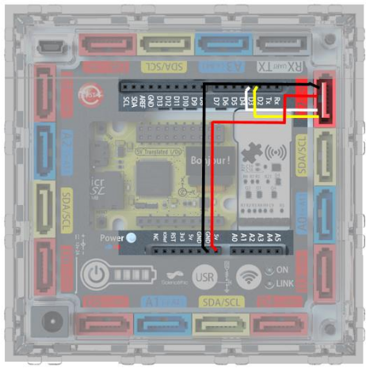

Plan : Découvrir le Plug'Uino Py
===============================

1. Qu'est qu'un microcontroleur ?
2. Présentation du boitier Plug'Uino Py
3. Les modes de fonctionnements
    * Mode interface
    * Mode REPL
3. Le "Hello world" du Plug Py
    * Montage
    * Utilisation d'un terminal REPL
    * Écriture d'un script
4. Mise en oeuvre de capteurs
    * Capteur de température
    * Capteur US
    * Capteur de pression
5. Conclusion
6. Annexe: tracer un graphique avec matplotlib

## Qu'est-ce qu'un microcontrôleur?

Un microcontrôleur (en notation abrégée µc, ou uc ou encore MCU en anglais) est un circuit intégré qui rassemble les éléments essentiels d'un ordinateur : processeur, mémoires (mémoire morte et mémoire vive), unités périphériques et interfaces d'entrées-sorties.  [Source wikipedia](https://fr.wikipedia.org/wiki/Microcontr%C3%B4leur#Utilisations_et_volume_du_march%C3%A9)

En dehors de l'architecture, les microcontrôleurs diffèrent des microprocesseurs sur les points suivants:  

* leur domaine d'utilisation (système embarqué ou informatique générale);
* leur prix (quelques euros ou quelques centaines voire milliers d'euros);
* leur consommation (moins d'un milliwatt à plusieurs dizaines de watt).

**Quelques microcontrôleurs usuels ...**

 

**... montés sur une carte de développement**

 

## Le boitier Plug'Uino Py

Le boitier Plug'Uino Py est commercialisé par la société [Sciencéthic](https://www.sciencethic.com/shop). Le modèle présent au lycée de Bois d'Olive contient une version simplifiée de la carte *Pyboard*. 

L'accès aux bornes d'entrée/sortie se fait par le biais de connecteurs SATA en respectant le code des couleurs:  

* *ROUGE*: données numériques;
* *BLEU*: données analogiques;
* *JAUNE*: utilisation du bus $I^2C$.

La connexion peut se faire également grâce aux connecteurs SIL.  

!!! tip "Remarque"
    Les connecteurs SATA et SIL de même nom sont connectés entre eux.  

L'alimentation et la connexion avec l'ordinateur se font via l'USB (connecteur en haut à gauche).  

La carte est automatiquement détectée par les systèmes récents (Linux Ubuntu ou W10) sans installation de pilotes annexes. Ce n'est pas le cas avec W7.
